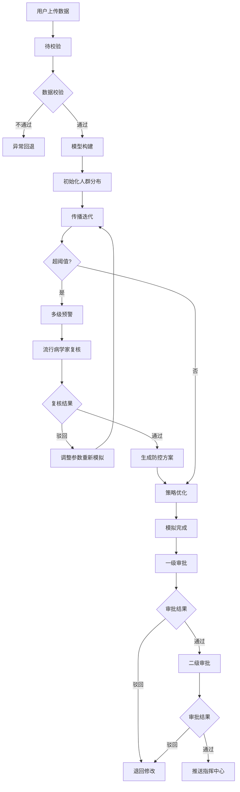
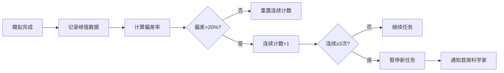

## 1. 产品概述

高精度病毒传播动力学模拟与防控策略优化平台，基于 SEIR 扩展模型与复杂网络传播理论，为公共卫生决策提供数据驱动的科学支撑。平台支持人口流动网络上传、病毒参数配置、干预措施模拟，通过全流程状态机管控模拟任务生命周期，内置多级预警机制与智能推荐引擎，最终生成可视化综合报告辅助指挥决策。

- 目标用户：流行病学家、公共卫生决策者、疾控中心指挥人员、首席科学家
- 核心价值：将复杂的流行病学计算封装为可操作的工作流，实现"上传-模拟-预警-复核-优化-决策"的闭环管理

## 2. 核心功能

### 2.1 用户角色

| 角色 | 注册方式 | 核心权限 |
|------|----------|----------|
| 系统管理员 | 内部账号 | 用户管理、系统配置、全局监控 |
| 流行病学家 | 内部账号 | 数据上传、参数配置、任务发起、预警复核、策略调整 |
| 审批人 | 内部账号 | 一级/二级审批、结果确认 |
| 指挥中心用户 | 内部账号 | 查看已审批结果、综合报告、数据导出 |
| 首席科学家 | 内部账号 | 异常处理、暂停/恢复任务、高级策略配置 |

### 2.2 功能模块

1. **任务管理中心**：任务列表、状态看板、新建任务、任务详情、异常回退
2. **模拟配置中心**：人口流动网络上传、病毒参数配置、干预措施设置、初始人群分布
3. **实时监控大屏**：传播迭代进度、R0实时曲线、医疗资源占用率、多级预警指示器
4. **预警复核中心**：预警列表、流行病学家复核、调整日志记录、方案重新模拟
5. **策略优化引擎**：智能推荐防控组合、隔离方案生成、疫苗接种方案、效果对比
6. **报告与数据中心**：感染曲线、空间扩散图、干预效果对比、综合报告PDF、数据导出
7. **审批工作流**：一级审批、二级审批、审批历史、指挥中心推送
8. **性能统计看板**：每日完成率、预警提前量、优化次数、峰值偏差统计
9. **系统管理**：用户管理、角色权限、阈值配置、通知设置

### 2.3 页面详情

| 页面名称 | 模块名称 | 功能描述 |
|----------|----------|----------|
| 登录页 | 身份验证 | 账号密码登录、角色选择、安全验证 |
| 工作台首页 | 数据概览 | 任务统计卡片、今日预警、待办事项、快捷操作入口 |
| 任务管理页 | 任务列表 | 任务表格、状态筛选、搜索、分页、批量操作 |
| 任务详情页 | 详情面板 | 基本信息、状态流转时间线、模拟参数、结果数据 |
| 新建任务页 | 配置向导 | 三步式向导：上传数据→配置参数→设置干预 |
| 实时监控页 | 监控大屏 | 实时图表、进度条、预警灯、R0曲线、资源占用率 |
| 预警复核页 | 预警列表 | 预警卡片、级别标签、复核操作、调整记录 |
| 策略优化页 | 推荐引擎 | 智能推荐方案、参数调整、效果对比、方案保存 |
| 报告中心页 | 报告列表 | 报告预览、PDF下载、数据导出（城市/时间维度） |
| 审批中心页 | 待审列表 | 两级审批流程、审批意见、历史记录 |
| 性能看板页 | 统计图表 | 每日完成率趋势、预警提前量统计、优化次数分析 |
| 系统设置页 | 配置管理 | 用户管理、阈值配置、通知模板、系统参数 |

## 3. 核心流程

### 3.1 模拟任务全生命周期流程

用户上传人口流动网络数据与病毒参数，系统进入待校验状态；校验通过后自动构建传播模型并初始化人群分布，随后进入传播迭代计算；计算过程中实时监控R0与医疗资源占用率，超阈值时触发多级预警并推送至流行病学家；复核通过后自动生成隔离与疫苗接种方案，重新模拟并记录调整日志；模拟完成后结果进入两级审批流程，审批通过推送至指挥中心；连续三次峰值偏差超20%时系统自动暂停新任务并通知首席科学家。

### 3.2 峰值偏差监控流程

系统在每次模拟完成后记录峰值数据，与历史基准对比计算偏差率；连续三次偏差超20%时触发熔断机制，暂停新任务受理并自动通知首席科学家介入调查。

## 4. 用户界面设计

### 4.1 设计风格

**设计定位：科技感+专业权威+数据驱动**

- **主色调**：深海蓝 (#0A1628) 作为背景主色，传达专业与权威感
- **辅助色**：医疗蓝 (#2563EB) 用于主要操作与关键数据，警示红 (#EF4444) 用于高级预警，警戒橙 (#F59E0B) 用于中级预警，安全绿 (#10B981) 用于正常状态
- **点缀色**：科技青 (#06B6D4) 用于数据高亮与图表强调
- **按钮风格**：直角微圆角 (2px)，扁平化设计，悬停时有微妙的光效过渡
- **字体**：标题使用 Space Grotesk 展现科技感，正文使用 Inter 保证可读性，数字使用等宽字体 JetBrains Mono
- **布局风格**：模块化卡片布局，深色背景配合微光边框，营造监控大屏氛围
- **图标风格**：线性图标，统一 2px 线宽，状态图标使用填充式区分

### 4.2 页面设计概览

| 页面名称 | 模块名称 | UI 元素 |
|----------|----------|---------|
| 登录页 | 登录表单 | 深色渐变背景、粒子动画、玻璃态登录卡片、微动效输入框 |
| 工作台首页 | 概览面板 | 数据卡片矩阵、预警雷达图、待办时间线、快捷操作磁贴 |
| 任务管理页 | 任务列表 | 高级数据表格、状态标签、进度条、筛选侧边栏、批量操作栏 |
| 任务详情页 | 详情面板 | 状态时间线、参数卡片组、图表容器、操作按钮组 |
| 新建任务页 | 配置向导 | 步骤指示器、文件上传区、参数滑块、干预措施开关组 |
| 实时监控页 | 监控大屏 | 大图表面板、实时数据刷新、预警灯指示器、脉冲动画 |
| 预警复核页 | 预警列表 | 分级预警卡片、严重程度色条、复核操作面板、调整日志 |
| 策略优化页 | 推荐引擎 | 方案对比卡片、雷达图、参数调节滑块、推荐标识 |
| 报告中心页 | 报告列表 | 报告封面预览、下载按钮、导出维度选择器 |
| 审批中心页 | 审批流程 | 审批进度条、审批意见框、电子签名区、历史记录 |
| 性能看板页 | 统计图表 | 多维度图表、热力图、趋势线、关键指标KPI卡片 |
| 系统设置页 | 配置面板 | 分组标签页、表单项、开关控件、阈值滑块 |

### 4.3 响应式设计

- **设计原则**：Desktop-first，针对大屏监控场景优化
- **断点设置**：1920px（设计基准）、1440px、1024px、768px
- **移动端适配**：侧边栏收起为抽屉式导航，图表自适应缩放，表格转为卡片列表
- **触控优化**：移动端按钮最小 44px 触控区域，支持滑动手势操作

### 4.4 数据可视化规范

- **图表库**：基于 ECharts 定制主题
- **感染曲线**：面积图，不同人群状态用渐变色区分（易感-蓝、潜伏-黄、感染-红、恢复-绿）
- **空间扩散图**：热力地图，支持城市级颗粒度展示
- **R0曲线**：折线图，带阈值参考线与预警区间填充
- **医疗资源占用率**：仪表盘/环形进度条，三段式颜色分区
- **干预效果对比**：分组柱状图+折线图组合
