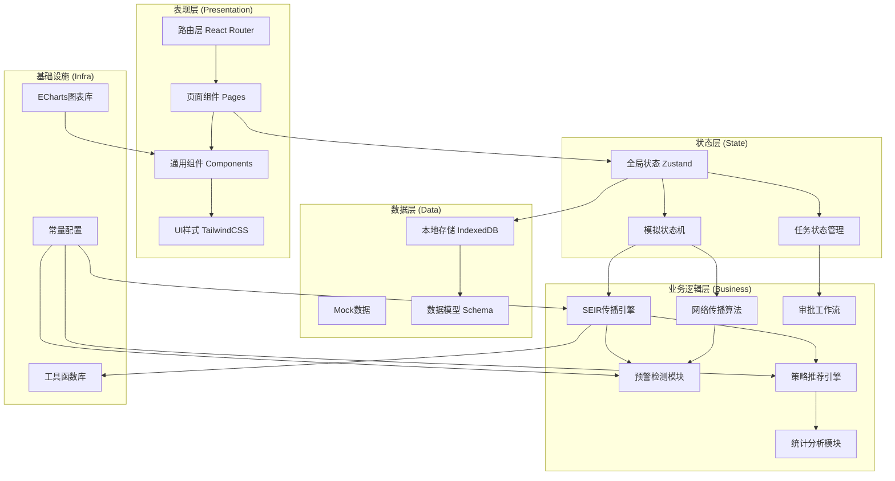
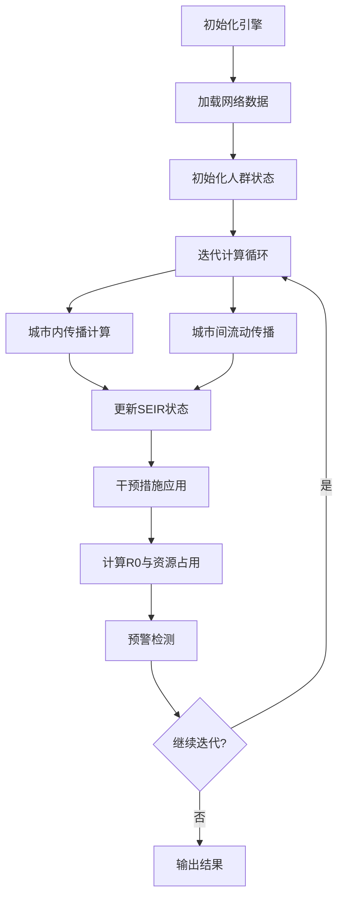
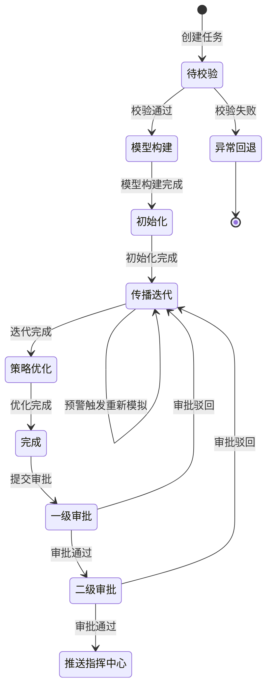

## 1. 架构设计

本平台采用前端单页应用架构，所有业务逻辑、模拟计算、数据可视化均在前端完成，使用本地存储持久化数据。整体采用分层架构设计，确保模拟引擎、状态管理、UI展示的松耦合。



## 2. 技术描述

- **前端框架**：React@18 + TypeScript@5
- **构建工具**：Vite@5
- **样式方案**：TailwindCSS@3 + CSS Variables
- **状态管理**：Zustand@4
- **路由方案**：React Router@6
- **图表库**：ECharts@5
- **图标库**：Lucide React
- **数据存储**：IndexedDB (Dexie.js)
- **工具库**：date-fns、uuid
- **PDF生成**：jsPDF + html2canvas
- **动画方案**：Framer Motion

## 3. 路由定义

| 路由路径 | 页面名称 | 权限角色 | 说明 |
|----------|----------|----------|------|
| /login | 登录页 | 所有 | 用户身份验证入口 |
| /dashboard | 工作台首页 | 所有已登录 | 数据概览与快捷操作 |
| /tasks | 任务管理页 | 流行病学家/管理员 | 模拟任务列表与管理 |
| /tasks/new | 新建任务页 | 流行病学家 | 三步式任务创建向导 |
| /tasks/:id | 任务详情页 | 流行病学家/审批人 | 任务详细信息与操作 |
| /monitor/:id | 实时监控页 | 流行病学家 | 模拟过程实时监控大屏 |
| /warnings | 预警复核页 | 流行病学家 | 预警列表与复核操作 |
| /strategy/:id | 策略优化页 | 流行病学家 | 防控策略推荐与对比 |
| /reports | 报告中心页 | 指挥中心/审批人 | 综合报告查看与下载 |
| /approvals | 审批中心页 | 审批人 | 两级审批工作流 |
| /performance | 性能看板页 | 管理员/首席科学家 | 性能统计与趋势分析 |
| /settings | 系统设置页 | 管理员 | 系统配置与用户管理 |
| /settings/thresholds | 阈值配置页 | 管理员/首席科学家 | 预警阈值与参数配置 |

## 4. 核心数据模型

### 4.1 模拟任务 (SimulationTask)

```typescript
interface SimulationTask {
  id: string;
  name: string;
  description: string;
  status: TaskStatus;
  createdBy: string;
  createdAt: Date;
  updatedAt: Date;
  params: VirusParams;
  networkData: NetworkData;
  interventions: InterventionConfig;
  population: PopulationConfig;
  results?: SimulationResult;
  warnings: WarningRecord[];
  adjustmentLogs: AdjustmentLog[];
  approvalStatus: ApprovalStatus;
  approvalHistory: ApprovalRecord[];
  peakDeviation?: number;
  iterations: number;
  currentIteration: number;
}

type TaskStatus = 
  | 'pending_validation'
  | 'model_building'
  | 'initializing'
  | 'iterating'
  | 'strategy_optimizing'
  | 'completed'
  | 'error'
  | 'rollback';
```

### 4.2 病毒参数 (VirusParams)

```typescript
interface VirusParams {
  r0: number;
  incubationPeriod: number;
  infectiousPeriod: number;
  severeRate: number;
  mortalityRate: number;
  recoveryRate: number;
  transmissionProbability: number;
  latentPeriod: number;
}
```

### 4.3 人口流动网络 (NetworkData)

```typescript
interface NetworkData {
  cities: City[];
  edges: FlowEdge[];
  totalPopulation: number;
}

interface City {
  id: string;
  name: string;
  population: number;
  position: { lat: number; lng: number };
  medicalCapacity: number;
}

interface FlowEdge {
  from: string;
  to: string;
  flowRate: number;
  transportMode: string;
}
```

### 4.4 干预措施 (InterventionConfig)

```typescript
interface InterventionConfig {
  isolation: IsolationConfig;
  vaccination: VaccinationConfig;
  travelRestriction: TravelRestrictionConfig;
  socialDistancing: SocialDistancingConfig;
}

interface IsolationConfig {
  enabled: boolean;
  coverage: number;
  complianceRate: number;
  startTime: number;
}

interface VaccinationConfig {
  enabled: boolean;
  dailyCapacity: number;
  efficacy: number;
  priorityGroups: string[];
  startTime: number;
}
```

### 4.5 模拟结果 (SimulationResult)

```typescript
interface SimulationResult {
  timeSeries: TimePoint[];
  cityData: CityResult[];
  peakInfection: number;
  peakTime: number;
  totalInfected: number;
  totalRecovered: number;
  totalDeaths: number;
  r0Evolution: number[];
  medicalResourceUsage: ResourceUsage[];
  interventionEffect: InterventionEffect;
}

interface TimePoint {
  day: number;
  susceptible: number;
  exposed: number;
  infected: number;
  recovered: number;
  deceased: number;
  severe: number;
  r0: number;
  resourceUsage: number;
}
```

### 4.6 预警记录 (WarningRecord)

```typescript
interface WarningRecord {
  id: string;
  taskId: string;
  level: 'low' | 'medium' | 'high' | 'critical';
  type: 'r0_threshold' | 'resource_overflow' | 'peak_anomaly';
  message: string;
  value: number;
  threshold: number;
  triggeredAt: Date;
  iteration: number;
  reviewed: boolean;
  reviewedBy?: string;
  reviewedAt?: Date;
  reviewResult?: 'approved' | 'rejected';
  reviewComment?: string;
}
```

### 4.7 审批记录 (ApprovalRecord)

```typescript
interface ApprovalRecord {
  id: string;
  taskId: string;
  level: 1 | 2;
  status: 'pending' | 'approved' | 'rejected';
  approver: string;
  comment: string;
  approvedAt?: Date;
}
```

## 5. 核心模块架构

### 5.1 SEIR传播引擎架构



### 5.2 状态机设计



## 6. 目录结构

```
src/
├── assets/              # 静态资源
│   ├── fonts/          # 字体文件
│   └── images/         # 图片资源
├── components/         # 通用组件
│   ├── ui/            # 基础UI组件
│   ├── charts/        # 图表组件
│   ├── layout/        # 布局组件
│   └── common/        # 业务组件
├── pages/             # 页面组件
│   ├── Login/
│   ├── Dashboard/
│   ├── Tasks/
│   ├── Monitor/
│   ├── Warnings/
│   ├── Strategy/
│   ├── Reports/
│   ├── Approvals/
│   ├── Performance/
│   └── Settings/
├── store/             # 状态管理
│   ├── useTaskStore.ts
│   ├── useWarningStore.ts
│   ├── useUserStore.ts
│   └── useSystemStore.ts
├── engine/            # 模拟引擎
│   ├── SEIR/          # SEIR模型
│   ├── network/       # 网络传播
│   ├── warning/       # 预警检测
│   ├── strategy/      # 策略推荐
│   └── stats/         # 统计分析
├── types/             # TypeScript类型定义
├── utils/             # 工具函数
├── hooks/             # 自定义Hooks
├── constants/         # 常量配置
├── data/              # Mock数据
└── styles/            # 全局样式
```

## 7. 关键技术决策

1. **前端计算**：模拟引擎全部在前端运行，使用 Web Worker 避免阻塞主线程，支持大计算量场景
2. **状态管理**：Zustand 轻量状态管理，配合 Immer 支持不可变数据更新
3. **数据持久化**：IndexedDB 存储任务与结果数据，LocalStorage 存储用户偏好
4. **图表性能**：ECharts 支持大数据量渲染，使用 Canvas 模式提升性能
5. **模拟算法**：基于改进 SEIR 模型，结合元胞自动机与复杂网络理论
6. **预警机制**：多级阈值检测算法，支持动态阈值调整
7. **策略推荐**：基于多目标优化算法，综合考量防控效果与经济成本
